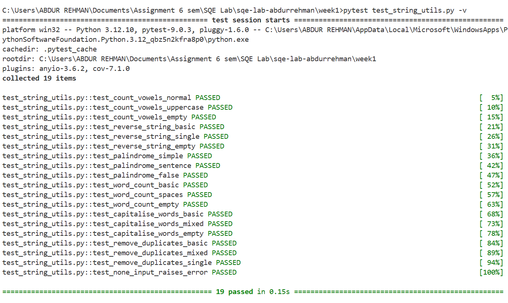
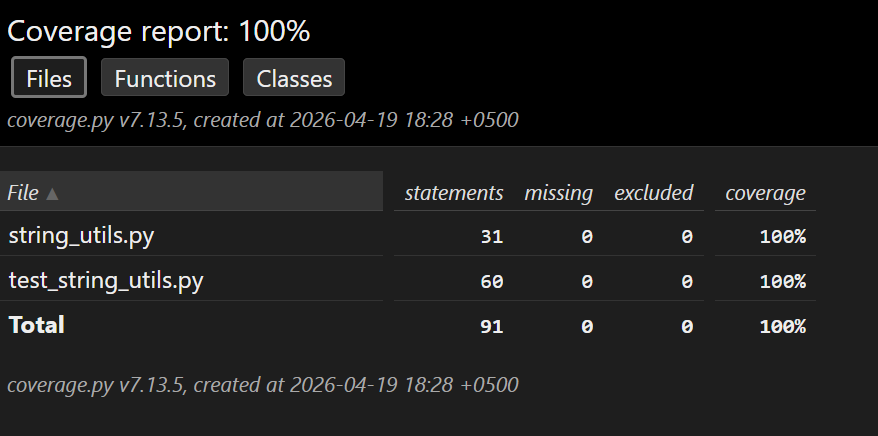

# 🧪 Lab Task 1 — String Utilities Module (Implementation & Testing)

---

## 📌 Overview

This task focuses on implementing a **String Utilities module** and validating its functionality through **unit testing using pytest**. The goal is to ensure correctness, robustness, and high code coverage.

---

## 🛠 Tools & Technologies Used

* Python 3.11+
* pytest
* coverage.py
* Visual Studio Code
* Git & GitHub

---

## 📂 Project Structure

```
week1/
│── string_utils.py
│── test_string_utils.py
│── coverage_report.txt
│── images/
    ├── image6.png   # pytest output
    └── image7.png   # coverage report
```

---

## ✅ Implementation Details

### 1. Source Code Development

Implemented `string_utils.py` with the following functions:

* `count_vowels(text)`
* `reverse_string(text)`
* `is_palindrome(text)`
* `word_count(text)`
* `capitalise_words(text)`
* `remove_duplicates(text)`

✔ All functions include:

* Input validation
* Edge case handling
* Exception handling (`TypeError` for None input)

---

### 2. Unit Test Development

Created `test_string_utils.py` with:

✔ 18+ test cases
✔ Edge case coverage
✔ Exception handling tests
✔ Proper naming convention (`test_<function>_<condition>`)

---

### 3. Test Execution

Executed tests using:

```
pytest test_string_utils.py -v
```

✔ Result: All tests passed successfully.

📷 Output:


---

### 4. Code Coverage Measurement

Executed coverage analysis:

```
coverage run -m pytest test_string_utils.py -v
coverage report -m
```

✔ Result:

* Achieved **100% code coverage**

📷 Output:


📄 Detailed report available in:
[View Coverage Report](./coverage_report.txt)

---

## 🎯 Key Achievements

✔ Implemented all required functions correctly
✔ Wrote comprehensive test suite (18+ tests)
✔ Handled edge cases and exceptions
✔ Achieved **100% test coverage**
✔ Successfully validated all functionality

---

## 🧠 Key Learnings

* Writing clean and testable Python functions
* Designing effective unit tests
* Importance of edge case testing
* Understanding code coverage metrics
* Difference between coverage and correctness

---

## 🚀 Conclusion

This task successfully demonstrated:

* Complete implementation of a functional module
* Robust testing using pytest
* High-quality validation through coverage analysis

The module is fully tested, reliable, and meets all Software Quality Engineering standards.

---
