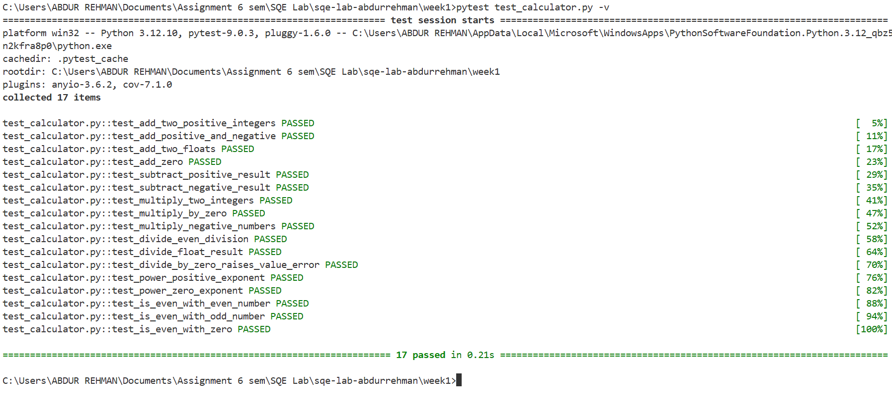
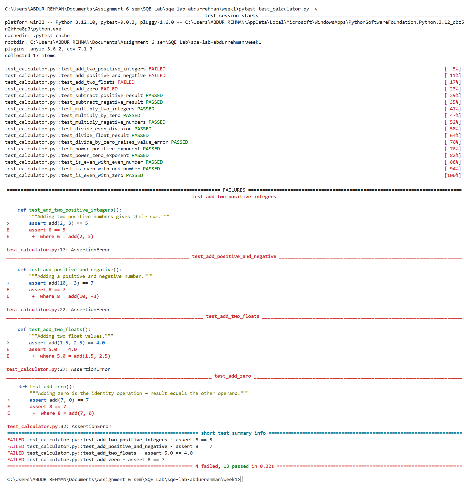
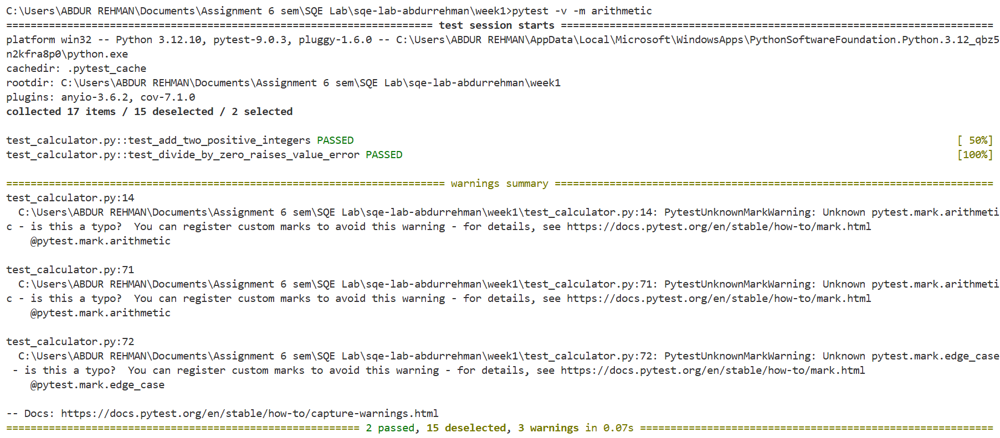
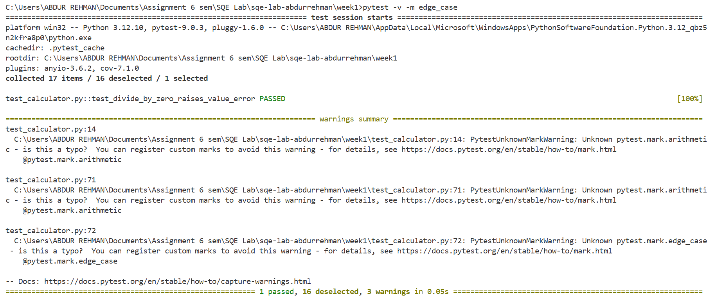
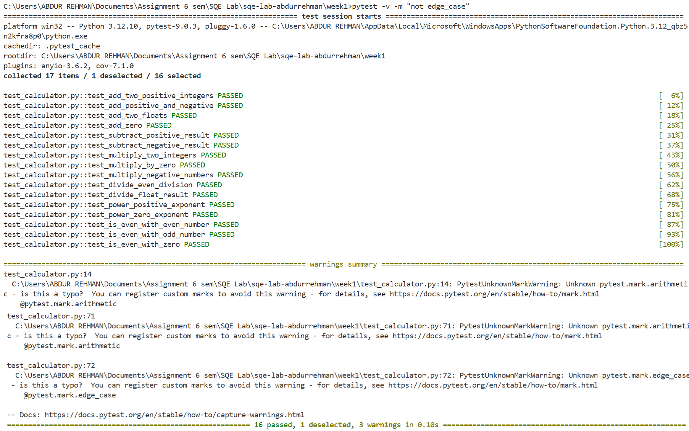

# Week 1 — Lab Environment Setup & First Test Execution

## 📌 Overview

This lab focuses on setting up a complete Software Quality Engineering (SQE) environment and executing the first automated test suite using **pytest**. The objective is to understand unit testing, test execution, failure analysis, and test categorization using markers.

---

## 🛠 Tools & Technologies Used

* Python 3.11+
* pytest
* pytest-cov
* Visual Studio Code
* Git & GitHub

---

## 📂 Project Structure

```
week1/
│── calculator.py
│── test_calculator.py
│── images/
    ├── image1.png
    ├── image2.png
    ├── image3.png
    ├── image4.png
    └── image5.png
```

---

## ✅ Implementation Details

### 1. Environment Setup

* Installed all required tools and VS Code extensions.
* Configured Python and pytest environment.

---

### 2. Source Code & Test Development

* Implemented `calculator.py` with basic arithmetic functions.
* Created `test_calculator.py` following pytest conventions.
* Wrote unit tests for all functions.

---

### 3. Initial Test Execution

Executed tests using:

```
pytest test_calculator.py -v
```

✔ Result: All tests passed successfully.

📷 Output:


---

### 4. Failure Injection & Analysis

* Introduced a deliberate bug in the `add()` function.
* Re-ran the test suite.

✔ Result:

* 4 tests failed
* 13 tests passed

📷 Output:


This step helped in understanding how pytest reports failures and how assertions work.

---

### 5. Bug Fix & Re-testing

* Fixed the issue in `add()` function.
* Re-ran tests.

✔ Result: All tests passed again.

---

### 6. Test Markers & Grouping

Added pytest markers to categorize tests:

* `@pytest.mark.arithmetic`
* `@pytest.mark.edge_case`

---

### 7. Selective Test Execution

#### ▶ Run only arithmetic tests

```
pytest -v -m arithmetic
```

📷 Output:


---

#### ▶ Run only edge case tests

```
pytest -v -m edge_case
```

📷 Output:


---

#### ▶ Run all except edge cases

```
pytest -v -m "not edge_case"
```

📷 Output:


---

## 🎯 Key Learnings

* How to write and structure unit tests using pytest
* Understanding test results: **PASSED, FAILED**
* Debugging failed test cases
* Importance of test coverage and correctness
* Using pytest markers for efficient test execution

---


## 🚀 Conclusion

This lab successfully demonstrated the complete workflow of:

* Writing testable code
* Executing automated tests
* Analyzing failures
* Organizing tests using markers

The environment is now fully configured for upcoming SQE labs.

---
