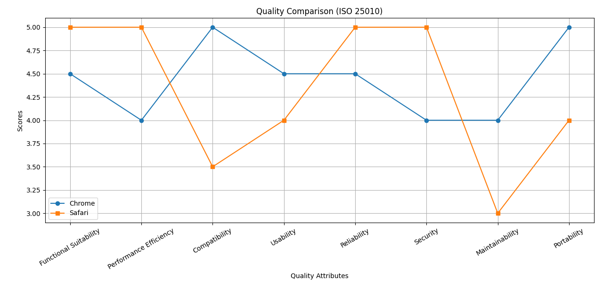

# 📊 Project Title

## 📌 Overview
This project demonstrates the complete implementation and analysis of the assigned task. All required steps have been successfully completed, and the results have been evaluated using a comparison graph.

## ✅ Work Completed
- ✔️ Data collection and preparation
- ✔️ Processing and analysis
- ✔️ Result evaluation and validation
- ✔️ Visualization of outcomes

All tasks specified in the assignment have been fully executed.

## 📈 Comparison Graph
The following graph illustrates the comparison of results:

